# GDD - Game Design Document - Módulo 1 - Inteli

**_Os trechos em itálico servem apenas como guia para o preenchimento da seção. Por esse motivo, não devem fazer parte da documentação final_**

## Nome do Grupo

#### Nomes dos integrantes do grupo

## Sumário

[1. Introdução](#c1)

[2. Visão Geral do Jogo](#c2)

[3. Game Design](#c3)

[4. Desenvolvimento do jogo](#c4)

[5. Casos de Teste](#c5)

[6. Conclusões e trabalhos futuros](#c6)

[7. Referências](#c7)

[Anexos](#c8)

 

# 1. Introdução (sprints 1 a 4)

## 1.1. Plano Estratégico do Projeto

### 1.1.1. Contexto da indústria (sprint 2)

Cenário de Mercado e Estratégia da Cielo S.A.

No contexto das Cinco Forças de Porter, o mercado brasileiro de pagamentos  apresenta uma divisão clara entre a adquirência tradicional, liderada por empresas como Cielo e Rede, e o avanço das fintechs focadas em pequenas e médias empresas (SMBs), como Stone e PagSeguro, que integram gestão e contas digitais ao seu portfólio (Biz, 2024). Além desses modelos, o setor é complementado por estruturas de Adquirência as a Service e subadquirente, que aumentam a complexidade competitiva (Silva Lopes Advogados, 2024).
A Cielo tem respondido à ameaça de produtos substitutos — especialmente o Pix e as carteiras digitais — por meio de uma reorientação estratégica que prioriza a digitalização e a oferta de serviços financeiros integrados. Segundo a Cielo (2024), a companhia deixou de focar exclusivamente no aluguel de terminais físicos (hardware) para se tornar uma plataforma de dados e serviços (software), buscando reduzir a dependência das taxas de intercâmbio tradicionais. Após o fechamento de seu capital em 2024 para fins de reestruturação (InfoMoney, 2024), a empresa intensificou sua migração para o modelo de Banking as a Service (BaaS), superando a simples disputa por taxas de transação.
Uma das principais frentes estratégicas é a interoperabilidade. Para neutralizar o avanço do Pix como substituto direto do cartão de débito, a Cielo integrou o pagamento via QR Code em todos os seus terminais, permitindo que o lojista aceite o pagamento instantâneo centralizando a conciliação financeira (Valor Econômico, 2023). Essa tática visa manter a empresa indispensável na rotina do varejista, mesmo que o meio de pagamento mude. Conforme aponta o portal Suno Notícias (2024), a estratégia de defesa inclui ainda o investimento no "Cielo Gestão", antecipação de recebíveis e inteligência de mercado. Ao agregar análise de dados à transação, a Cielo busca elevar os custos de mudança (switching costs) para o cliente, dificultando a migração para serviços gratuitos.
Para o biênio 2025-2026, as tendências estratégicas focam na desmaterialização do terminal físico, através do Tap to Phone, na implementação do Pix Automático e no uso intensivo de Inteligência Artificial para recuperar margens operacionais e enfrentar a concorrência direta da Rede (InvestNews, 2025; Mobile Time, 2025)

### 1.1.1.1. Modelo de 5 Forças de Porter (sprint 2)

As Forças de Porter são um modelo de análise criado por Michael Porter que tem como objetivo avaliar o nível de competitividade de um setor. O modelo identifica cinco forças que influenciam o mercado: a rivalidade entre concorrentes, o poder de barganha dos clientes, o poder de barganha dos fornecedores, a ameaça de novos entrantes e a ameaça de produtos substitutos. A partir dessa análise, as empresas conseguem compreender melhor o ambiente competitivo e desenvolver estratégias para se posicionar de forma mais eficiente e obter vantagem competitiva.

#### Análise da ameaça de produtos ou serviços substitutos

No cenário brasileiro, o setor de adquirência é consolidado por empresas como Mercado Pago, PagSeguro (PagBank), Stone, Ton, InfinitePay, Cielo, Getnet, SumUp e C6 Pay. Segundo o portal Consumidor Moderno (2018), essas organizações são as principais precursoras de inovações tecnológicas no mercado nacional, introduzindo métodos como pagamentos por aproximação (Near Field Communication - NFC), biometria, leitura de QR Codes e integração com carteiras digitais.
Entretanto, a principal ameaça de substituição não provém apenas de novas tecnologias de hardware, mas de mudanças estruturais no sistema de pagamentos. O surgimento e a rápida adoção do Pix representa um desafio direto ao modelo de negócios das maquininhas. Conforme aponta a análise do InfoMoney (2023), as transferências instantâneas têm apresentado um crescimento exponencial, oferecendo custos menores para os lojistas e conveniência para os consumidores, o que posiciona o sistema de pagamentos instantâneos como o principal substituto das transações tradicionais feitas por maquininhas.

#### Poder de Barganha dos Fornecedores na Indústria de Meios de Pagamento
Identificação dos principais fornecedores da indústria
A Cielo atua no setor de adquirência e tecnologia para meios de pagamento, dependendo de fornecedores estratégicos em três categorias principais: bandeiras de cartão, infraestrutura tecnológica (computação em nuvem) e fornecedores de hardware (maquininhas). A análise desses fornecedores permite compreender o grau de poder de barganha exercido sobre a empresa e sobre a indústria como um todo.
##### Bandeiras de cartão
De acordo com dados recentes sobre participação de mercado no Brasil, as principais bandeiras são Mastercard (51%), Visa (31%) e Elo (14%), enquanto outras bandeiras somam aproximadamente 3% (YourPay, 2024). Observa-se que Mastercard e Visa concentram juntas mais de 80% do mercado, o que evidencia elevada concentração e reduzido número de fornecedores relevantes nesse segmento.
Essa concentração aumenta significativamente o poder de barganha das bandeiras, uma vez que as adquirentes dependem da autorização e do credenciamento dessas empresas para processar pagamentos. A substituição dessas bandeiras não é viável, dado o nível de aceitação e preferência dos consumidores.
##### Parceiros tecnológicos (infraestrutura de nuvem)
No segmento de infraestrutura de nuvem, o mercado é liderado por três grandes empresas: Amazon Web Services (AWS), Microsoft Azure e Google Cloud Platform, que juntas concentram aproximadamente 65% do mercado global (Megaport, 2024). A Microsoft, inclusive, mantém parceria estratégica com a Cielo para fornecimento de infraestrutura tecnológica (Microsoft, 2023).
A elevada concentração do setor, aliada aos altos custos de migração entre provedores de nuvem (switching costs), fortalece o poder de barganha desses fornecedores. A troca de fornecedor envolve custos financeiros, riscos operacionais e necessidade de reestruturação tecnológica, o que limita a capacidade de negociação das adquirentes.
##### Fornecedores de hardware
No fornecimento de maquininhas de cartão (POS), destacam-se empresas como Verifone e Ingenico no cenário internacional, além da Pax Technologies, líder no Brasil. A produção de equipamentos para o mercado nacional também envolve a Transire, maior fabricante de maquininhas fora da China (InfoMoney, 2023).
Assim como nos demais segmentos, há dependência tecnológica e custos elevados de substituição de fornecedores, o que reforça o poder de barganha dessas empresas. A padronização tecnológica e a necessidade de certificações específicas dificultam a entrada de novos fabricantes.
#### Análise do poder de barganha dos fornecedores e impacto na indústria
Com base na análise das três categorias, verifica-se que os principais fornecedores da Cielo são grandes empresas globais com forte concentração de mercado. Essa característica estrutural eleva o poder de barganha dos fornecedores, pois:
Há baixa quantidade de alternativas relevantes.
Os custos de troca são elevados.
Os fornecedores detêm tecnologias essenciais ao funcionamento do negócio.
A dependência é estrutural e comum a todas as adquirentes do setor.
Dessa forma, o setor de adquirência apresenta forte influência dos fornecedores estratégicos, especialmente das bandeiras e dos provedores de nuvem. Esse cenário impacta diretamente as margens das empresas, reduz sua capacidade de negociação e contribui para a intensificação da rivalidade competitiva na indústria.
#### Poder de Barganha dos Clientes na Indústria de Meios de Pagamento

A Cielo atende pouco mais de 1.2 milhões de clientes que vão do pequeno empreendedor ao grande varejista (ALMAP BBDO, 2025). Por isso, a própria empresa possui uma estratégia de segmentação de mercado, para classificar cada cliente de acordo com suas necessidades. Essa segmentação se dá de duas formas: por porte (Mobile Time, 2022) e por setor (Cielo, 2025).

##### Segmentação por porte 
Microempreendedores Individuais (MEI)
O grupo dos microempreendedores individuais é constituído por pequenas operações com baixo volume de vendas, como autônomos e pequenos negócios. Apesar da importância numérica desse segmento, o poder de barganha individual desses clientes é limitado, uma vez que nenhum representa uma fatia significativa do faturamento total da empresa (CNN, 2022). No entanto, coletivamente, esse segmento pode exercer influência caso ocorram migrações em massa para serviços concorrentes.
##### Microempresas, Pequenas e Médias Empresas (PMEs)
As PMEs constituem parte fundamental da base de clientes da Cielo, representando um grande número de usuários que buscam soluções de pagamento adaptadas a negócios menores. A empresa oferece variadas soluções tecnológicas que atendem desde o pequeno varejo até empresas de porte médio, reforçando sua estratégia de atuação ampla em vários segmentos do mercado.
Individualmente, esses clientes possuem baixo poder de barganha no mercado devido ao grande número de empresas desse tipo. Entretanto, coletivamente, podem exercer um poder maior frente à concorrência, especialmente se houver opções alternativas de adquirência disponíveis.
##### Grandes Contas
Grandes contas são empresas com alto volume de transações e representatividade no faturamento total de pagamentos processados (Moody’s, 2024). A Cielo possui soluções customizadas para esse segmento, incluindo atendimento dedicado e soluções que levam em conta as necessidades específicas desses grandes clientes (Cielo, 2023).
Clientes desse porte tendem a possuir alto poder de barganha, pois representam uma parcela significativa das receitas da Cielo e, portanto, podem negociar condições comerciais mais favoráveis.
##### E-commerce ( Qualquer porte )
O segmento de e-commerce engloba lojas virtuais, marketplaces e vendedores online que utilizam soluções digitais de pagamento. A Cielo oferece plataformas de integração para e-commerce, como APIs e links de pagamento, ajudando empreendedores a vender online com segurança e eficiência (Cielo, 2025).
Devido à facilidade de troca entre uma plataforma de pagamento e outra no ambiente digital, esses clientes possuem um poder de barganha moderado — maior do que pequenos negócios isolados, mas menor do que grandes contas físicas — uma vez que mudanças de fornecedor podem ocorrer com custo relativamente baixo.

##### Segmentação por setor
O Índice Cielo do Varejo Ampliado (ICVA) acompanha mensalmente a evolução do varejo brasileiro, de acordo com as vendas realizadas em 18 setores mapeados pela Cielo, desde pequenos lojistas a grandes varejistas. Eles respondem por mais de 870 mil clientes varejistas que vendem com a Cielo (2025).

##### Considerações finais
O poder de barganha dos clientes na indústria de adquirência varia conforme o porte e o perfil do cliente. Micro e pequenas empresas apresentam baixo poder individual, grandes contas exercem influência significativa sobre preços e condições comerciais e o segmento de e-commerce intensifica a competitividade devido às baixas barreiras de troca entre fornecedores.

#### Análise Geral da Rivalidade entre os Concorrentes Existentes
O mercado brasileiro de maquininhas de cartão apresenta alto nível de rivalidade competitiva, impulsionado pela presença de grandes players consolidados e pela entrada contínua de fintechs com propostas inovadoras. Em 2024, o ranking dos principais participantes do setor indicava o PagBank como líder de mercado, seguido por Cielo, Stone e Redecard (Exame, 2024). Essa configuração evidencia um ambiente competitivo no qual empresas disputam participação de mercado principalmente por meio de taxas mais atrativas, tecnologia embarcada e integração de serviços financeiros.
O PagBank se destaca nesse cenário ao oferecer as melhores taxas do mercado, estruturadas em planos flexíveis que variam de acordo com o faturamento do empreendedor, o que intensifica a rivalidade ao pressionar concorrentes a ajustarem suas condições comerciais. Paralelamente, o setor tem avançado em direção à integração total entre conta digital, maquininha e ferramentas de gestão de vendas, elevando o nível de complexidade competitiva e exigindo maior capacidade tecnológica das empresas atuantes (Exame, 2024).
Fintechs como PagBank, Mercado Pago e SumUp vêm investindo de forma consistente em inteligência artificial, análise de dados e segurança digital, com o objetivo de simplificar a gestão financeira e melhorar a experiência do usuário. Além disso, observa-se o crescimento do uso da tecnologia Tap to Pay, que permite transformar smartphones em maquininhas de pagamento, tendência que deve ganhar ainda mais relevância nos próximos anos e aumentar a pressão competitiva sobre modelos tradicionais (Pininfarina Brasil, 2025).
Em 2025, as maquininhas que dominam o mercado brasileiro são aquelas capazes de combinar baixas taxas, tecnologia avançada e simplicidade operacional. Nesse contexto, PagBank, Ton, Mercado Pago e SumUp figuram como referências absolutas segundo diferentes rankings especializados (Educando Seu Bolso, 2025; iDinheiro, 2025). Em contraste, uma análise comparativa realizada a partir de três dos principais sites especializados indica que as maquininhas ofertadas pela Cielo não figuraram entre as dez melhores opções em nenhum dos rankings avaliados, sugerindo uma perda relativa de competitividade frente aos novos entrantes e fintechs digitais (Educando Seu Bolso, 2025; iDinheiro, 2025).
Entretanto, é importante destacar que, em um dos levantamentos analisados, a Cielo aparece entre as sete principais fornecedoras de maquininhas, embora esse ranking considere as empresas como um todo e não a performance individual de seus dispositivos (iDinheiro, 2025). Esse dado demonstra que, apesar da forte rivalidade e da pressão competitiva exercida por fintechs, a Cielo ainda mantém relevância institucional no setor, ainda que enfrente desafios significativos para reposicionar seus produtos frente às alternativas mais modernas e competitivas.
De forma geral, o elevado grau de rivalidade existente no setor de maquininhas de cartão impacta diretamente a competitividade da indústria, promovendo inovação constante, redução de taxas e diversificação de serviços, ao mesmo tempo em que dificulta a sustentação de vantagens competitivas duradouras para empresas que não acompanham a evolução tecnológica do mercado.
Rivalidade entre os Concorrentes da Cielo no Mercado Brasileiro de Meios de Pagamento
A expressão “guerra das maquininhas” refere-se à disputa competitiva entre empresas que oferecem soluções de aceitação de cartões e meios de pagamento. Antes dominado por um pequeno número de credenciadoras, principalmente a Cielo e a Rede, o setor passou a registrar a entrada de diversas fintechs, como a PagSeguro, a Stone e a Getnet. Essas empresas passaram a disputar clientes por meio de taxas menores, maquininhas mais acessíveis, antecipação de recebíveis mais rápida e inovação em produtos digitais (Concil, 2019; Bloomberg Línea, 2022).
Estudos e relatórios indicam que a intensificação da concorrência provocou mudanças relevantes na participação de mercado das adquirentes brasileiras. Em determinados períodos, a Cielo mantinha cerca de 38% do volume de pagamentos por cartão, seguida pela Rede (25%) e pela GetNet (12%), enquanto Stone e PagSeguro apresentavam participações menores, porém em crescimento expressivo (Concil, 2019).
Segundo dados de 2022 da Associação Brasileira das Empresas de Cartões de Crédito e Serviços (conforme citado por Bloomberg Línea, 2022), no segundo trimestre daquele ano a participação aproximada era de 26% para a Cielo, 21,4% para a Rede e 13,9% para a GetNet. Esses números demonstram que, embora ainda líder, a Cielo viu sua liderança relativa diminuir com o aumento da concorrência. Fintechs voltadas para micro e pequenos empreendedores, como PagSeguro e Stone, ganharam espaço ao oferecer produtos mais simples e taxas agressivas, atraindo segmentos anteriormente pouco explorados.
A rivalidade entre as empresas incluiu diversos movimentos estratégicos relevantes. Entre eles, destaca-se a redução de taxas e a oferta de antecipação gratuita de recebíveis. Grandes players, como a Rede, zeraram taxas de antecipação para atrair lojistas (Exame, 2019).
Além disso, a PagSeguro passou a oferecer pagamentos ao lojista em prazos mais curtos, e outras empresas ajustaram suas ofertas para intensificar a captação de clientes (Seu Dinheiro, 2019). Outro movimento importante foi o investimento em soluções digitais integradas. As empresas ampliaram seus serviços para além das maquininhas físicas, incluindo conta digital, crédito, integração com ferramentas de gestão e opções de pagamento via QR Code ou dispositivos móveis. Essa estratégia visa consolidar clientes em ecossistemas mais amplos e reduzir a taxa de cancelamento.
A rivalidade entre os concorrentes da Cielo no Brasil, caracterizada como a “guerra das maquininhas”, representa uma competição intensa e em constante transformação no setor de meios de pagamento. A abertura do mercado possibilitou a entrada de novos players, obrigando a Cielo e seus concorrentes a inovar e reajustar suas estratégias em um ambiente de margens mais estreitas. Estratégias voltadas à redução de custos, ampliação de serviços e incorporação tecnológica tornaram-se fundamentais para manter ou ampliar a participação em um mercado cada vez mais dinâmico e disputado.

####  Ameaça de Novos Entrantes no Mercado Brasileiro de Maquininhas
O mercado brasileiro de adquirência — popularmente conhecido como mercado de “maquininhas” — passou por mudanças estruturais significativas nas últimas duas décadas. Antes concentrado em poucos agentes, como a Cielo e a Rede, o setor tornou-se mais competitivo após alterações regulatórias e avanços tecnológicos (Banco Central do Brasil [BCB], 2010). Nesse contexto, a análise da ameaça de novos entrantes, proposta no modelo das Cinco Forças de Porter (2004), torna-se fundamental para compreender a dinâmica competitiva atual.
Segundo Porter (2004), a ameaça de novos entrantes depende da existência de barreiras estruturais que dificultam o ingresso no setor. No mercado de maquininhas, destacam-se três principais barreiras: investimento inicial, regulação e economias de escala.
Primeiramente, o ingresso exige elevado investimento em tecnologia de processamento de pagamentos, sistemas antifraude, segurança da informação e estrutura operacional. Além disso, as empresas precisam cumprir exigências regulatórias estabelecidas pelo Banco Central, incluindo autorização para funcionamento como instituição de pagamento e adequação às normas de prevenção à lavagem de dinheiro (BCB, 2013).
Outro fator relevante é a economia de escala. Empresas consolidadas como Stone, PagSeguro e Getnet operam com grande volume transacionado, o que reduz o custo médio por operação e fortalece seu poder de negociação com bandeiras e instituições financeiras (ABECS, 2023). Essa escala representa uma barreira significativa para novos competidores que pretendem disputar mercado apenas por preço.
Apesar das barreiras estruturais, alguns fatores recentes reduziram a dificuldade de ingresso no setor. O avanço tecnológico e a digitalização dos serviços financeiros permitiram o surgimento de fintechs com modelos operacionais mais enxutos e digitais (ABECS, 2023).
Adicionalmente, a implementação do sistema de pagamentos instantâneos PIX pelo Banco Central ampliou a concorrência no mercado de pagamentos eletrônicos, incentivando inovação e reduzindo dependências tradicionais do cartão (BCB, 2020). Esse ambiente regulatório mais aberto estimulou a entrada de novos participantes e aumentou a contestabilidade do setor.
A ameaça de novos entrantes no mercado brasileiro de maquininhas pode ser classificada como moderada. Embora existam barreiras relevantes relacionadas a capital, regulação e escala, avanços tecnológicos e mudanças regulatórias reduziram obstáculos históricos. Conforme o modelo das Cinco Forças de Porter (2004), esse cenário contribui para intensificar a rivalidade e pressionar margens, tornando o setor cada vez mais dinâmico e competitivo.

### 1.1.2. Análise SWOT (sprint 2)

A matriz SWOT, ou FOFA, é uma abreviação para forças, oportunidades, fraquezas e ameaças. Ela é dividida em fatores internos e externos, sendo forças e fraquezas classificadas como internos, e oportunidades e ameaças como externos. Essa matriz ajuda a apoiar decisões estratégicas e o planejamento, além de organizar e entender alguns fatores da empresa, como quais oportunidades aproveitar, onde precisa melhorar e quais riscos precisa evitar. 

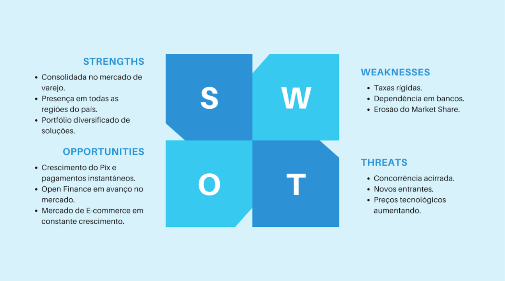

Figura 1.1.2.1 - Análise SWOT

Fonte: Material produzido pelos autores, 2026.

#### Forças

##### Consolidada no mercado de varejo;

Por estar presente no mercado varejista há 30 anos (CIELO, 2026)  e integrar o cotidiano de inúmeros brasileiros que utilizam seus produtos e serviços, a Cielo consolidou amplo reconhecimento entre os vendedores. Dessa forma, a marca deixou de ser percebida apenas como uma fornecedora de maquininhas de pagamento, passando a ser associada a uma empresa confiável, sólida e segura, que oferece suporte consistente e não desampara seus parceiros comerciais.

##### presença em todas as regiões do país
Ao manter atuação em todas as regiões do território nacional, a Cielo alcança mercados frequentemente pouco assistidos por suas concorrentes, incluindo áreas mais remotas e localidades de menor densidade populacional. Dessa forma, a empresa posiciona-se como pioneira em diversos contextos regionais, consolidando sua presença e conquistando a confiança de vendedores das mais variadas regiões do país.

##### Portfólio diversificado de soluções  
Em razão da necessidade de adaptar-se aos mais diversos perfis de vendedores e às diferentes realidades de mercado, a Cielo desenvolve soluções específicas para atender a cada demanda. Como exemplo, destaca-se a Cielo Tap, voltada a empreendedores que estão ingressando no mercado e que, por esse motivo, podem utilizar o próprio telefone celular como ferramenta para realização de transações, dispensando, inicialmente, o uso de uma maquininha física.

#### Fraquezas

##### Taxas rígidas para os clientes 
A Cielo apresenta menor flexibilidade na negociação de taxas quando comparada a fintechs e adquirentes digitais. (Idinheiro, 2026)Essa rigidez pode reduzir sua competitividade, principalmente entre micro e pequenos empreendedores sensíveis a custos. Em um mercado cada vez mais orientado por preço, taxas menos adaptáveis dificultam a retenção e atração de novos clientes. Como consequência, a empresa pode perder espaço para concorrentes com modelos mais dinâmicos e personalizados.

##### Dependência dos bancos controladores
A estrutura societária da Cielo está fortemente vinculada a grandes instituições financeiras, o que pode limitar sua autonomia estratégica. Decisões corporativas podem ser influenciadas pelos interesses dos bancos controladores, reduzindo agilidade frente às mudanças do mercado. Além disso, essa dependência pode dificultar parcerias com outras instituições financeiras concorrentes (investing, 2024). Em um setor altamente inovador, menor independência pode impactar a capacidade de adaptação.
	

##### Erosão do Market Share
Nos últimos anos, a Cielo tem enfrentado perda gradual de participação de mercado diante da ascensão de novas adquirentes e fintechs (InvestingNews, 2021). Empresas como PagSeguro e Stone adotaram modelos mais agressivos de precificação e atendimento. Esse cenário intensificou a competição e reduziu a vantagem histórica da Cielo no setor. A erosão do market share evidencia desafios na manutenção da liderança em um ambiente de alta rivalidade competitiva.

#### Oportunidades

##### Crescimento do pix e pagamentos instantâneos
Cerca de 165 milhões de pessoas e 14 milhões de empresas utilizam esses sistemas de pagamento de forma regular. De 2023 para 2024, foi observado um aumento de 52% no número de transações por pix (Dock Tech, 2025). Por esse tipo de pagamento estar em um crescimento exponencial, existe uma grande oportunidade da Cielo converter os clientes que usam a chave PIX manual para o PIX via maquininha.

##### Open Finance em avanço no mercado
Entre os anos de 2023 e 2024, foi registrado um aumento de 100% nos consentimentos de Open Finance registrados no Brasil (Exame, 2024). Isso leva a um cenário onde é interessante para a Cielo a ideia de oferecer soluções integradas de pagamento via Open Finance.

##### Mercado de E-commerce em constante crescimento
O e-commerce brasileiro faturou mais de R$ 200 bilhões em 2025, com crescimento superior a 10% (Edrone, 2026).  Isso coloca a Cielo em uma posição em que é vantajoso investir em fazer parte desse mercado, dado seu potencial de lucro.

#### Ameaças

##### Concorrência 
O mercado brasileiro de adquirência passou por uma transformação radical na última década. Três players emergiram como ameaças diretas e consolidadas à liderança histórica da Cielo: o Mercado Pago (BP Money, 2024), a Stone e a Pagbank (Infomoney, 2026). 

##### Novos entrantes substitutos
A maquininha física tradicional enfrenta uma ameaça de substituição por múltiplas tecnologias que não necessitam de hardware. Entre essas temos as principais Tap to Pay e o PIX por QR code, onde as empresas Nubank e Inter chegam em peso utilizando dessas tecnologias (Finsiders, 2023).

##### Aumento do preço dos hardwares
O advento da IA implicou diretamente no aumento do preço das peças tecnológicas no mercado (Inovadesk, 2026), desde processadores e memória RAM, até telas touchscreen e módulos de comunicação . Em consequência disso, as maquininhas eventualmente vão ficar mais caras.

### 1.1.3. Missão / Visão / Valores (sprint 2)

##### Missão:
Por estarem distribuídos pelo país, os gerentes de negócios da Cielo não recebem um treinamento homogêneo. Nossa missão é sanar esse problema por meio de uma plataforma gamificada de treinamento que capacitará igualmente todos os GN’s.

##### Visão:
Ser uma parte fundamental do treinamento dos Gerentes de negócios da Cielo ao resolver o problema da barreira geográfica.

##### Valores: 
Diversidade, responsabilidade social, linguagem simples e acessível, reconhecimento de bom desempenho, ensinar e capacitar.

### 1.1.4. Proposta de Valor (sprint 4)

*Posicione aqui o canvas de proposta de valor. Descreva os aspectos essenciais para a criação de valor da ideia do produto com o objetivo de ajudar a entender melhor a realidade do cliente e entregar uma solução que está alinhado com o que ele espera.*

### 1.1.5. Descrição da Solução Desenvolvida (sprint 4)

*Descreva brevemente a solução desenvolvida para o parceiro de negócios. Descreva os aspectos essenciais para a criação de valor da ideia do produto com o objetivo de ajudar a entender melhor a realidade do cliente e entregar uma solução que está alinhado com o que ele espera. Observe a seção 2 e verifique que ali é possível trazer mais detalhes, portanto seja objetivo aqui. Atualize esta descrição até a entrega final, conforme desenvolvimento.*

### 1.1.6. Matriz de Riscos (sprint 4)

*Registre na matriz os riscos identificados no projeto, visando avaliar situações que possam representar ameaças e oportunidades, bem como os impactos relevantes sobre o projeto. Apresente os riscos, ressaltando, para cada um, impactos e probabilidades com plano de ação e respostas.*

### 1.1.7. Objetivos, Metas e Indicadores (sprint 4)

*Definição de metas SMART (específicas, mensuráveis, alcançáveis, relevantes e temporais) para seu projeto, com indicadores claros para mensuração*

## 1.2. Requisitos do Projeto (sprints 1 e 2)

\# | Requisitos funcionais  
--- | ---
RF01 |  O jogo deve fornecer um sistema para o controle da movimentação do personagem principal para o jogador.
RF02 |  O jogo deve ser mundo aberto.
RF03 |  O jogo deve possuir múltiplos estabelecimentos no mapa.
RF04 |  O jogador deve poder entrar nos estabelecimentos.
RF05 |  O jogo deve possuir sistema de captura em turnos.
RF06 |  O jogador deve escolher entre diferentes opções durante o turno.
RF07 |  Cada captura deve simular uma situação real com clientes.
RF08 |  O turno deve possuir sistema de reputação do vendedor.
RF09 |  Os personagens dos estabelecimentos devem possuir um sistema de satisfação.
RF10 |  O jogo deve ter uma tela inicial.
RF11 |  A tela inicial deve conter um botão de jogar.
RF12 |  Ao clicar no botão de jogar, o usuário deve ser direcionado para a tela de escolha do personagem jogável.
RF13 |  O jogo deve fornecer mais de um personagem jogável.
RF14 |  O jogador deve escolher seu personagem jogável dentro da opções disponíveis.
RF15 |  O jogo deve ter um botão continuar na tela de escolha.
RF16 |  Ao clicar no botão continuar o jogador deve ser direcionado a tel de tutorial.
RF17 |  O jogo deve possuir um tutorial interativo. 
RF18 |  O jogador deve interagir com o tutorial para avançar.
RF19 |  O tutorial deve apresentar informações sobre a empresa.
RF20 |  O tutorial deve apresentar informações sobre os produtos.
RF21 |  O jogo deve aumentar a dificuldade a cada cena vencida pelo jogador.
RF22 |  O jogo dever dar dicas e revisões conforme o progresso do jogo.
RF23 |  Cada turno é vencido quando o nível de satisfação atingir o máximo.
RF24 |  Cada turno é perdido quando o nível de satisfação atingir o mínimo.

\# | Requisitos não funcionais
--- | ---
RNF01 | O jogo deve possuir um design interativo
RNF02 | Deve funcionar em sistemas Windows 10 ou superior.
RNF03 | O jogo deve apresentar interface intuitiva e de fácil compreensão.
RNF04 | O jogo deve possuir acessibilidade básica (legendas, contraste adequado e textos legíveis).
RNF05 | O jogo deve apresentar compatibilidade com teclado e mouse.
RNF06 | O código do sistema deve seguir boas práticas de organização e modularização.
RNF07 | O jogo deve ser visualmente confortável.

## 1.3. Público-alvo do Projeto (sprint 2)

Foi definido no workshop promovido pela Cielo e proposto aos grupos que o público-alvo do jogo Mestre de Vendas é composto pelos Gerentes de Negócios (GNs) da Cielo, profissionais responsáveis pela atuação comercial porta a porta na venda das maquininhas e soluções de pagamento da empresa. Esses colaboradores têm como principal atribuição apresentar os benefícios dos produtos, negociar condições comerciais e captar novos clientes.
Dado que a Cielo é uma empresa que atua no âmbito nacional, é natural que os Gerentes de Negócios não estejam concentrados em uma única região do país. Como o objetivo do jogo é proporcionar um treinamento padronizado entre todos os colaboradores, não devem ser feitas distinções entre regiões, buscando nesse âmbito um perfil mais geral.
Além disso, o treinamento deve ser direcionado especialmente para a capacitação dos GNs na abordagem de estabelecimentos com faturamento igual ou superior a  R$ 15.000,00 mensais. Esse recorte é relevante por representar um segmento significativo dentro da estratégia de expansão comercial da empresa, exigindo argumentação adequada, domínio técnico das soluções ofertadas e capacidade de negociação.

# 2. Visão Geral do Jogo (sprint 2)

## 2.1. Objetivos do Jogo (sprint 2)

Para concluir o jogo, o jogador deve atingir a meta de captação de potenciais clientes da Cielo. No contexto da narrativa, o jogador assumirá o papel de Gerente de Negócios (GN), profissional responsável pela prospecção e negociação porta a porta junto a estabelecimentos comerciais.
A missão consiste em visitar diferentes tipos de empreendimentos, como padarias, postos de gasolina, restaurantes, entre outros, com o objetivo de apresentar os benefícios das soluções de pagamento oferecidas pela empresa e persuadir os proprietários ou responsáveis comerciais a adotarem a maquininha da Cielo. Cada estabelecimento será um desafio para o jogador.
Durante as interações, os personagens que representam os comerciantes apresentarão objeções comuns ao processo de venda, tais como a alegação de que concorrentes oferecem taxas mais baixas ou a preferência por marcas já conhecidas e consolidadas. Nesse cenário, caberá ao jogador analisar cada situação e selecionar os argumentos mais adequados para contornar as objeções apresentadas, demonstrando conhecimento técnico, capacidade de negociação e domínio das vantagens competitivas da empresa.
O objetivo final é ampliar a base de clientes da Cielo dentro do ambiente do jogo,  deixando o mundo azul. 

## 2.2. Características do Jogo (sprint 2)

### 2.2.1. Gênero do Jogo (sprint 2)

O jogo configura-se como um RPG de turno, no qual o jogador assume o papel de um personagem, toma decisões estratégicas e enfrenta desafios em rodadas organizadas, evoluindo ao longo da narrativa. Nesse contexto, o jogador representa um gerente de negócios (GN) da Cielo. O participante terá como objetivo captar novos clientes para a empresa a cada conjunto de turnos, sendo cada conjunto simbolizado por um estabelecimento comercial distinto. A cada rodada, o jogador deverá tomar decisões estratégicas que impactarão seu desempenho, simulando desafios reais do mercado competitivo. 

### 2.2.2. Plataforma do Jogo (sprint 2)

Nosso jogo poderá ser acessado em qualquer dispositivo com navegador web, seja ele no telefone, no computador, notebook entre outros.

### 2.2.3. Número de jogadores (sprint 2)

O jogo será desenvolvido para ser jogado por um único jogador, já que seu objetivo é ser um treinamento para os GNs, não necessitando de uma funcionalidade multiplayer para ser cumprido.

### 2.2.4. Títulos semelhantes e inspirações (sprint 2)

A principal inspiração visual e de navegação para o projeto é a franquia clássica Pokémon (em suas versões 2D de GBA/SNES). O jogo apropria-se da perspectiva top-down (visão superior), permitindo que o avatar do jogador caminhe livremente pelas ruas de uma cidade e faça a transição para dentro dos prédios comerciais. A dinâmica de "batalhas" do Pokémon serve como inspiração indireta para as interações de vendas: ao abordar um lojista, o GN entra em uma interface de diálogo onde precisa escolher as "técnicas" ou "argumentos" corretos (como se fossem os ataques ou itens) para convencer o cliente a fechar o credenciamento com a Cielo.

### 2.2.5. Tempo estimado de jogo (sprint 5)

*Ex. O jogo pode ser concluído em 3 horas passando por todas as fases.*

*Ex. cada partida dura até 15 minutos*

# 3. Game Design (sprints 2 e 3)

## 3.1. Enredo do Jogo (sprints 2 e 3)

O enredo acompanha o primeiro dia de trabalho de uma pessoa recém-contratada para o cargo de Gerente de Negócios (GN) da Cielo. A narrativa inicia-se no Espaço Cielo, onde a personagem protagonista é recebida para o processo de onboarding. Nessa etapa inicial de contextualização, equivalente ao tutorial, a pessoa jogadora participa de um treinamento introdutório voltado à compreensão do portfólio de produtos da empresa, incluindo maquininhas de pagamento, taxas e benefícios oferecidos, além das principais técnicas de abordagem em vendas.

O conflito narrativo estabelece-se quando a pessoa GN é direcionada ao trabalho de campo, caracterizado pela estratégia de prospecção “porta a porta”, com o objetivo de cumprir uma meta desafiadora de credenciamentos. O jogo tem início com a visita da pessoa GN a uma padaria, na qual deve persuadir a pessoa proprietária a tornar-se cliente da Cielo. Em seguida, a pessoa jogadora deve prosseguir para o próximo estabelecimento da lista.

Entre as possibilidades de interação, pode ocorrer a situação denominada repique, na qual a pessoa GN retorna a um estabelecimento já visitado para acompanhar a pessoa cliente e fortalecer o relacionamento comercial com a empresa. Cada estabelecimento visitado apresenta um novo aprendizado ou introduz uma nova terminologia relacionada às práticas comerciais da organização.

Nesses momentos de aprendizado, a pessoa GN retorna ao Espaço Cielo para realizar etapas adicionais de capacitação. Após concluir o aprimoramento necessário, a personagem retorna ao campo para dar continuidade às próximas etapas do jogo. O progresso da narrativa ocorre à medida que os estabelecimentos da lista tornam-se clientes da Cielo. Ao final desse processo, quando todos os credenciamentos são realizados, o jogo é concluído e a pessoa GN finaliza o treinamento proposto.

## 3.2. Personagens (sprints 2 e 3)

### 3.2.1. Controláveis

O jogo possui quatro personagens controláveis, sendo dois homens e duas mulheres, que podem ser escolhidos no início da partida. Os homens são João (um homem negro) e José (um homem branco), e as mulheres são Maria (uma mulher parda) e Paula (uma mulher branca). Esses personagens representam os Gerentes de Negócios da Cielo e têm como objetivo conquistar determinados vendedores e transformá-los em clientes da empresa. Eles não possuem habilidades específicas, ou seja, a escolha do personagem não altera a experiência do usuário.

Figura 3.2.1.1 - Sprite do João

Fonte: [LimeZu](http://limezu.itch.io/), 2025 e editado pelos autores, 2026.

Figura 3.2.1.2 - Sprite do José

Fonte: [LimeZu](http://limezu.itch.io/), 2025 e editado pelos autores, 2026.

Figura 3.2.1.3 - Sprite da Maria

Fonte: [LimeZu](http://limezu.itch.io/), 2025 e editado pelos autores, 2026.

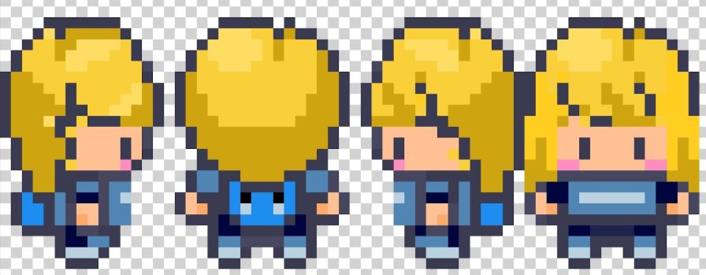

Figura 3.2.1.4 - Sprite da Paula

Fonte: [LimeZu](http://limezu.itch.io/), 2025 e editado pelos autores, 2026

### 3.2.2. Non-Playable Characters (NPC)

O jogo conta com os chamados Non-Playable Characters, que são, de forma literal, personagens não-jogáveis. Esse conjunto de personagens são responsáveis por duas partes do jogo: as capturas por turno e o apoio ao jogador. Nas capturas, temos quatro personagens que representam os donos de quatro estabelecimentos: Tião, o dono de uma padaria;  Pedro, o dono de uma loja de roupas; Márcia, a dona de farmácia e Leila, a dona de um salão de beleza. Na ajuda ao jogador, temos o Mestre de Vendas, um personagem que representa o estadual responsável. Ele é quem realiza a dinâmica do tutorial inicial no jogo, passando as principais informações técnicas e orientações de jogabilidade ao usuário.
O processo de criação dos NPCs ocorreu em duas etapas principais: primeiro, o desenho feito à mão, detalhando características específicas alinhadas aos valores da equipe; em seguida, o aprimoramento com o apoio de ferramentas de inteligência artificial, a fim de garantir melhor visualização e refinamento dos personagens.
Para a próxima sprint, o objetivo é realizar o desenho manual das sprites desses personagens, que serão utilizadas no desenvolvimento das animações e farão parte da dinâmica do jogo.

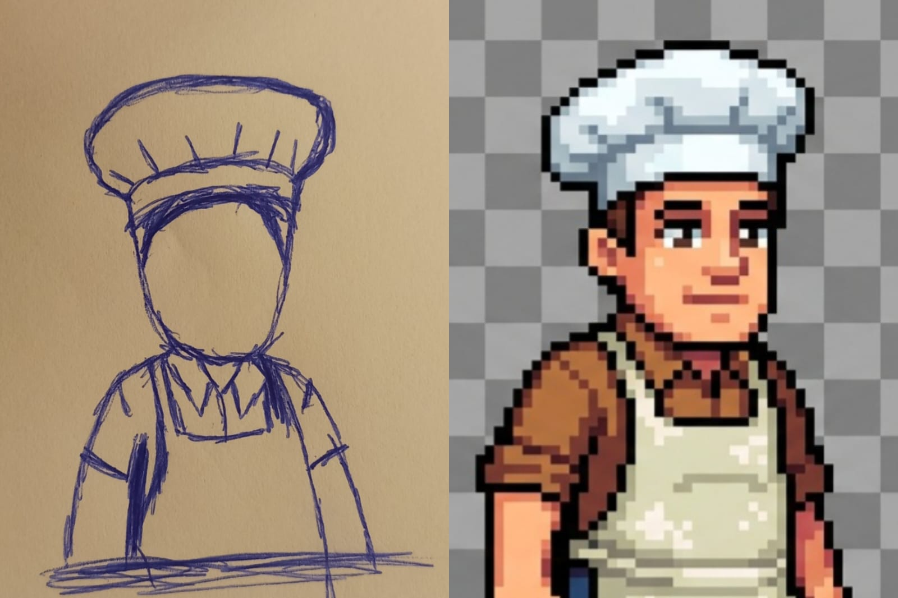
Figura 3.2.2.1 - Esboço e digitalização do Tião, o dono da padaria.

Fonte: Material produzido pelos autores, 2026.

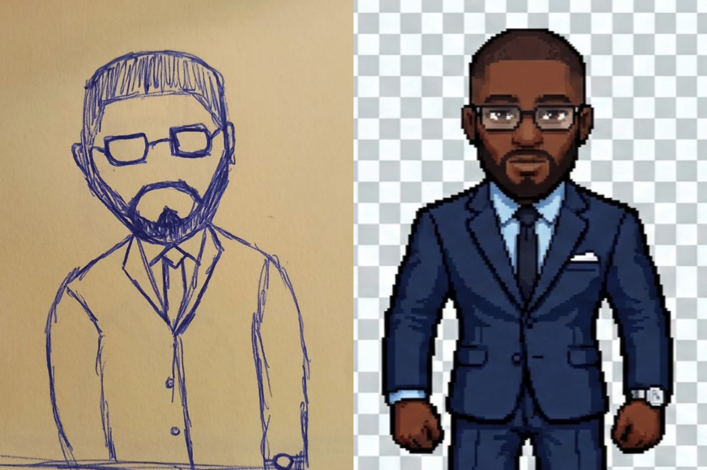

Figura 3.2.2.2 - Esboço e digitalização do Pedro, o dono da loja de roupas.

Fonte: Material produzido pelos autores, 2026.

Figura 3.2.2.3 - Esboço e digitalização da Márcia, a dona de farmácia.

Fonte: Material produzido pelos autores, 2026.

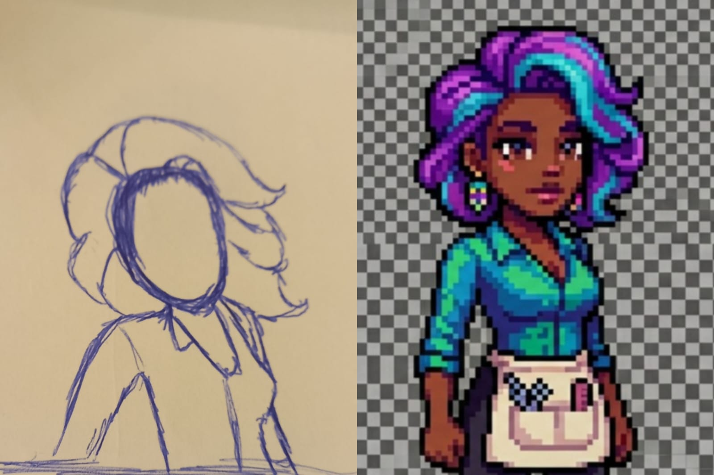

Figura 3.2.2.4 - Esboço e digitalização da Leila, a dona de salão de beleza.

Fonte: Material produzido pelos autores, 2026.

Figura 3.2.2.5 - Digitalização do estadual (Mestre de vendaa Cielo)

Fonte: Material produzido pelos autores, 2026.

### 3.2.3. Diversidade e Representatividade dos Personagens

Tendo em vista o fato de a Cielo ser uma empresa nacional, presente em diversas regiões de um país com território de dimensões continentais e marcado por ampla diversidade cultural, social e étnica, torna-se fundamental que o jogo esteja alinhado aos valores institucionais da organização. Nesse contexto, a promoção da inclusão e da representatividade não se configura apenas como uma escolha estética ou narrativa, mas como um posicionamento coerente com a identidade e a atuação da empresa no mercado brasileiro.
Os personagens foram desenvolvidos com foco na representatividade e na inclusão. Por essa razão, optou-se pela criação de quatro personagens jogáveis, sendo duas mulheres e dois homens. Entre eles, há uma mulher e um homem negros, bem como uma mulher e um homem brancos, buscando contemplar diferentes perfis e promover maior diversidade dentro do jogo. Essa escolha impacta diretamente a experiência dos jogadores, pois amplia as possibilidades de identificação e pertencimento, permitindo que diferentes públicos se vejam representados na narrativa. Ao reconhecer traços de sua própria realidade nos personagens, o jogador tende a estabelecer maior conexão emocional com o jogo, fortalecendo o engajamento e a sensação de valorização.
Além disso, o desenvolvimento de NPCs que também refletiram essa proposta inclusiva, ampliando a pluralidade de identidades, origens e vivências presentes na narrativa. A equipe permanece aberta à incorporação de novos personagens diversos, de modo a fortalecer continuamente o compromisso com a representatividade e assegurar que o jogo dialogue de forma sensível e respeitosa com a realidade multicultural do Brasil. Dessa forma, a inclusão deixa de ser apenas um elemento conceitual e passa a constituir um fator estruturante da experiência do usuário, contribuindo para a construção de um ambiente virtual mais equitativo, acolhedor e alinhado aos valores institucionais da empresa. 

## 3.3. Mundo do jogo (sprints 2 e 3)

### 3.3.1. Locações Principais e/ou Mapas (sprints 2 e 3)

| Local                         | Descrição Narrativa                                                                 | Função no Jogo                                                                 |
|--------------------------------|--------------------------------------------------------------------------------------|---------------------------------------------------------------------------------|
| Agência Cielo (Centro)        | O "QG" do jogador. Prédio corporativo localizado estrategicamente no centro do mapa. | Ponto de partida (Hub), local de nascimento do sprite (personagem) e área de tutoriais. |
| Padaria & Farmácia             | Estabelecimentos menores de comércio rápido e essencial.                            | Locais das "primeiras missões" e batalhas de vendas introdutórias com objeções mais simples. |
| Loja de Roupas & Salão         | Comércios focados em serviços e bens de consumo.                                    | Clientes intermediários, exigindo argumentos diferentes focados em parcelamento e taxas. |
| Hotel & Shopping Center        | Grandes estabelecimentos localizados nas extremidades do mapa.                      | Clientes de alta complexidade ("Chefões"), exigindo o domínio completo do portfólio da Cielo. |

### 3.3.2. Navegação pelo mundo (sprints 2 e 3)

A navegação do personagem ocorre de maneira livre pelo mapa 2D, utilizando uma visão top-down clássica de jogos de RPG.
Controles de Movimento: O jogador utiliza as teclas UP, DOWN, LEFT e RIGHT para caminhar pelas ruas e interagir com o ambiente.
Transições de Tela: Ao encostar na porta de um comércio (ex: Padaria, Farmácia), o jogador é teleportado para o interior da loja.
Interação (Batalha): Ao se aproximar do balcão e interagir com o NPC (lojista) através de uma tecla de ação (ex: barra de espaço ou 'E'), o jogo transita da tela de exploração para a interface de "Batalha de Vendas", onde o jogador escolhe seus argumentos em um menu de escolhas.

### 3.3.3. Condições climáticas e temporais (sprints 2 e 3)

*\<opcional\> Descreva diferentes condições de clima que podem afetar o mundo e as fases, se aplicável*

*Caso seja relevante, descreva como o tempo passa, se ele é um fator limitante ao jogo (ex. contagem de tempo para terminar uma fase)*

### 3.3.4. Concept Art (sprint 2)

Abaixo estão os estudos iniciais de level design e a identidade visual do jogo em pixel art.

Figura 3.3.4.1 - Estudo de interface visual e estilo de arte (Pixel Art). A imagem ilustra a visão top-down, o sprite do personagem principal (Gerente de Negócios) e a fachada de estabelecimentos comuns (Padaria e Farmácia).

Fonte: Material produzido pelos autores, 2026.

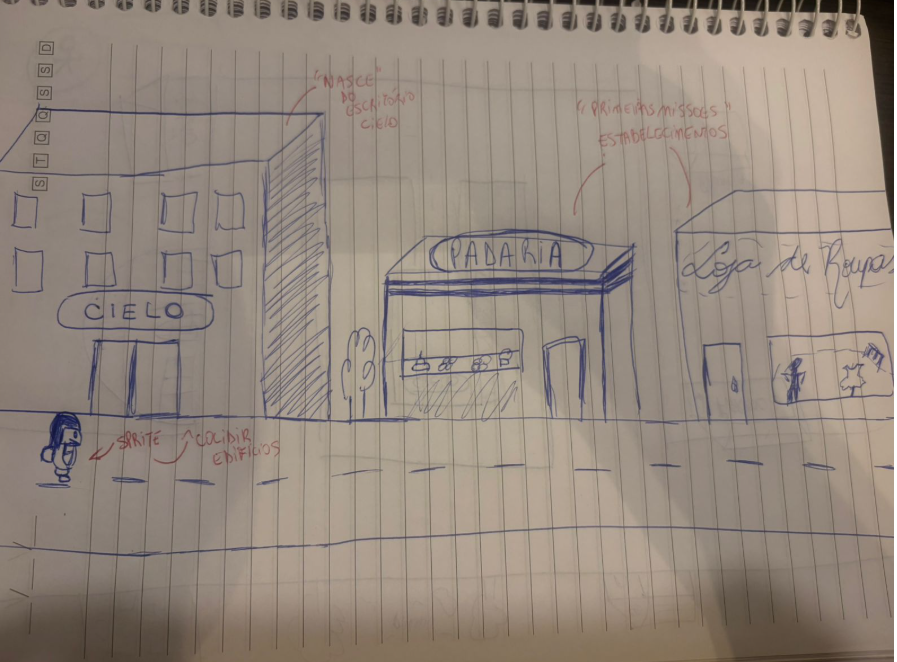

Figura 3.3.4.2 - Esboço preliminar (Side-scroller) ilustrando a escala dos edifícios. Destaque para o escritório da Cielo como ponto de partida (nascimento do sprite) e os estabelecimentos vizinhos que servirão como as primeiras missões.

Fonte: Material produzido pelos autores, 2026.

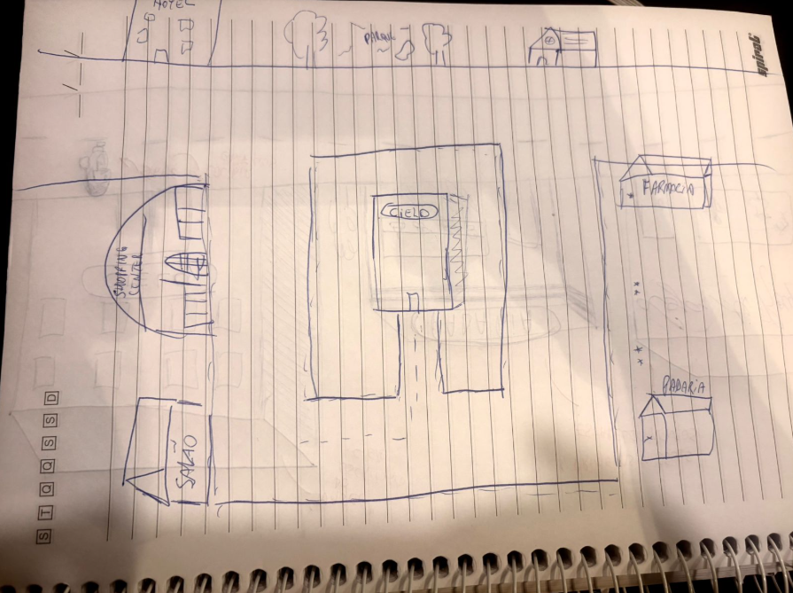

Figura 3.3.4.3 - Esboço do Mapa Geral (Top-down). Demonstra a centralidade do prédio da Cielo no level design, facilitando o acesso radial aos diferentes perfis de clientes ao redor (Shopping Center, Hotel, Salão, Farmácia e Padaria).

Fonte: Material produzido pelos autores, 2026.

### 3.3.5. Trilha sonora (sprint 4)

*Descreva a trilha sonora do jogo, indicando quais músicas serão utilizadas no mundo e nas fases. Utilize listas ou tabelas para organizar esta seção. Caso utilize material de terceiros em licença Creative Commons, não deixe de citar os autores/fontes.*

*Exemplo de tabela*
\# | titulo | ocorrência | autoria
--- | --- | --- | ---
1 | tema de abertura | tela de início | própria
2 | tema de combate | cena de combate com inimigos comuns | Hans Zimmer
3 | ... 

## 3.4. Inventário e Bestiário (sprint 3)

### 3.4.1. Inventário

*\<opcional\> Caso seu jogo utilize itens ou poderes para os personagens obterem, descreva-os aqui, indicando títulos, imagens, meios de obtenção e funções no jogo. Utilize listas ou tabelas para organizar esta seção. Caso utilize material de terceiros em licença Creative Commons, não deixe de citar os autores/fontes.* 

*Exemplo de tabela*
\# | item |  | como obter | função | efeito sonoro
--- | --- | --- | --- | --- | ---
1 | moeda |  | há muitas espalhadas em todas as fases | acumula dinheiro para comprar outros itens | som de moeda
2 | madeira |  | há muitas espalhadas em todas as fases | acumula madeira para construir casas | som de madeiras
3 | ... 

### 3.4.2. Bestiário

*\<opcional\> Caso seu jogo tenha inimigos, descreva-os aqui, indicando nomes, imagens, momentos de aparição, funções e impactos no jogo. Utilize listas ou tabelas para organizar esta seção. Caso utilize material de terceiros em licença Creative Commons, não deixe de citar os autores/fontes.* 

*Exemplo de tabela*
\# | inimigo |  | ocorrências | função | impacto | efeito sonoro
--- | --- | --- | --- | --- | --- | ---
1 | robô terrestre |  |  a partir da fase 1 | ataca o personagem vindo pelo chão em sua direção, com velocidade constante, atirando parafusos | se encostar no inimigo ou no parafuso arremessado, o personagem perde 1 ponto de vida | sons de tiros e engrenagens girando
2 | robô voador |  | a partir da fase 2 | ataca o personagem vindo pelo ar, fazendo movimento em 'V' quando se aproxima | se encostar, o personagem perde 3 pontos de vida | som de hélice
3 | ... 

## 3.5. Gameflow (Diagrama de cenas) (sprint 2)

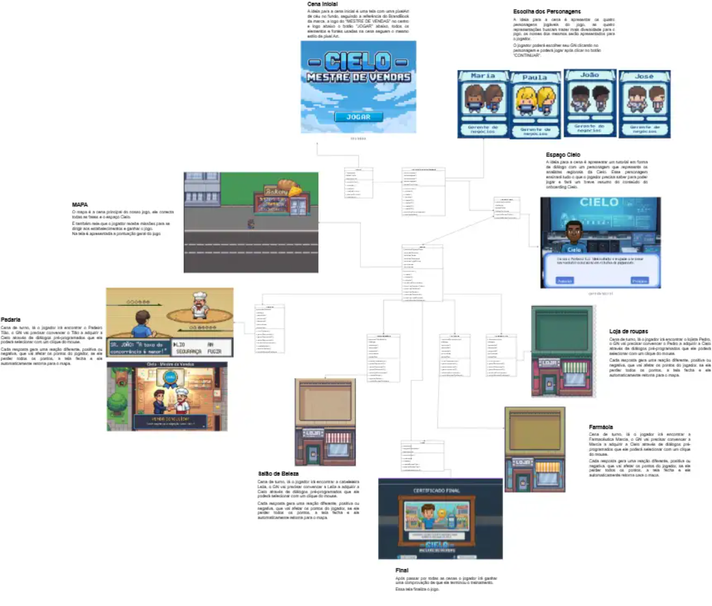

Abaixo segue o link para o Diagrama de cenas
https://drive.google.com/file/d/1GeqHsMznrFn84V90vxuoyxyVOwySS4b-/view?usp=sharing

## 3.6. Regras do jogo (sprint 3)

- O jogador não pode avançar para um estabelecimento sem passar para o tutorial;
- O jogador não pode avançar para um estabelecimento sem antes cumprir o anterior;
- O jogador não pode ir para o próximo estabelecimento sem passar pelo espaço Cielo;
- O jogador deve ir em todos os estabelecimentos;
- O jogador não pode acessar estabelecimentos sem fazer repique;
- A cada rodada o jogador deve convencer um comerciante a virar um cliente Cielo;
- O jogador deve convencer todos os comerciantes da cidade a virarem clientes Cielo;
- O jogador deve responder a todos os chamados do analista estadual;
- A cada resposta errada o nível de humor do comerciante da rodada cai;
- A cada resposta certa o nível de humor do comerciante da rodada sobe;
- O jogador deve responder conforme o padrão ensinado no onboarding da Cielo.

## 3.7. Mecânicas do jogo (sprint 3)

*Descreva aqui as formas de controle e interação que o jogador tem sobre o jogo: quais os comandos disponíveis, quais combinações de comandos, e quais as ações consequentes desses comandos. Utilize listas ou tabelas para organizar esta seção.*

*Ex. Em um jogo de plataforma 2D para desktop, o jogador pode usar as teclas WASD para mecânicas de andar, mirar para cima, agachar, e as teclas JKL para atacar, correr, arremesar etc.*

*Ex. Em um jogo de puzzle para celular, o jogador pode tocar e arrastar sobre uma peça para movê-la sobre o tabuleiro, ou fazer um toque simples para rotacioná-la*

## 3.8. Implementação Matemática de Animação/Movimento (sprint 4)

*Descreva aqui a função que implementa a movimentação/animação de personagens ou elementos gráficos no seu jogo. Sua função deve se basear em alguma formulação matemática (e.g. fórmula de aceleração). A explicação do funcionamento desta função deve conter notação matemática formal de fórmulas/equações. Se necessário, crie subseções para sua descrição.*

# 4. Desenvolvimento do Jogo

## 4.1. Desenvolvimento preliminar do jogo (sprint 1)

4.1. Desenvolvimento da Primeira Versão (Sprint 1)
O desenvolvimento desta primeira versão teve como objetivo principal estabelecer a estrutura fundamental do jogo, conectando a interface de usuário inicial com o ambiente de gameplay, em conformidade com os requisitos levantados na Seção 1.2. O foco foi entregar uma navegação funcional e a ambientação visual do projeto.

Implementação da Tela Inicial

Como primeiro requisito funcional, foi identificada a necessidade de uma tela de "Menu Principal". A tela inicial foi construída utilizando uma paleta de cores em tons de azul e um fundo em pixel art representando o céu, elementos que remetem diretamente à identidade visual da Cielo.

Na parte superior, foi inserido o título "Cielo: Mestre de Vendas" e, na inferior, o botão "Jogar". Em termos de codificação com o framework Phaser, este botão foi definido como um elemento interativo através do método setInteractive. Para garantir feedback visual ao usuário, foram programados eventos de pointerover e pointerout que alteram a escala do botão (setScale), criando um efeito dinâmico ao passar o mouse. O clique no botão dispara o evento scene.start, responsável pela transição para a cena do jogo.

Figura 4.1.1 - tela inicial do jogo

Fonte: Material produzido pelos autores, 2026.

Implementação do Cenário (Escritório)

Após a interação com o menu, o jogador é transportado para a cena principal: o Escritório. Nesta etapa, foi entregue a renderização do mapa de tiles (Tilemap) e o posicionamento do personagem principal. A lógica de movimentação básica foi implementada, permitindo que o jogador explore o ambiente, o que valida a base técnica para as futuras mecânicas de venda.

Dificuldades Encontradas

Durante esta etapa, a principal dificuldade técnica foi o gerenciamento de escalas dos assets em pixel art. Garantir que as imagens não ficassem borradas ao serem redimensionadas exigiu a configuração correta da propriedade pixelArt: true nas configurações do Phaser e ajustes manuais nas dimensões da câmera. Além disso, a sincronização da transição de cenas exigiu várias reviews do código para garantir que os assets da próxima cena fossem carregados corretamente.

Próximos Passos

Implementação da Mecânica de Vendas: Adicionar NPCs (clientes) e criar o sistema de interação/diálogo.
HUD e Pontuação: Criar a interface que mostra o saldo e metas de vendas na tela.
Colisões: Refinar as áreas de colisão do escritório para impedir que o personagem atravesse paredes ou móveis utilizando o sistema de física Arcade do Phaser.

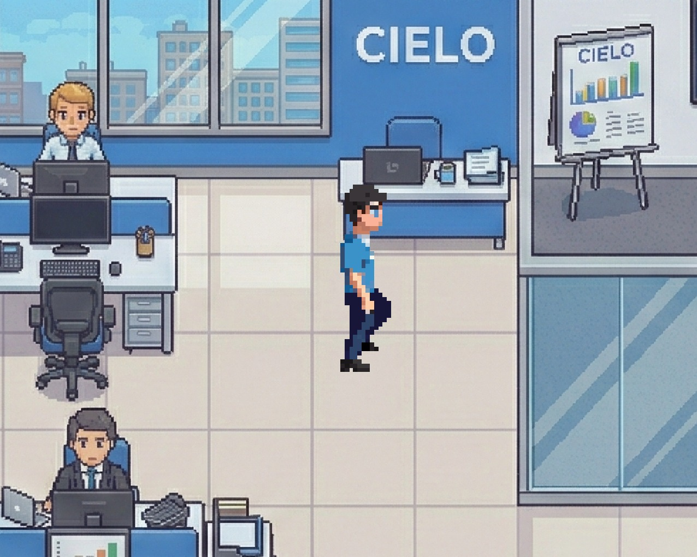
Figura 4.1.2 - concept art do escritório Cielo

Fonte: Material produzido pelos autores, 2026.

## 4.2. Desenvolvimento básico do jogo (sprint 2)

4.2. Desenvolvimento da Versão Básica (Sprint 2)
O desenvolvimento da versão básica do jogo nesta segunda sprint teve como foco a materialização do ambiente de jogo e a implementação do sistema de física. O objetivo principal foi entregar a renderização do mapa, a integração da sprite do personagem principal e o funcionamento adequado das colisões.
Implementação do Mapa e Delimitação de Escopo O cenário do jogo foi construído utilizando a ferramenta externa Tiled Map Editor. O ambiente foi desenhado através de tilesets e dividido em camadas lógicas (piso, paredes e obstáculos). Para garantir a qualidade da entrega dentro do prazo estipulado, a equipe realizou uma delimitação de escopo, priorizando a construção e o polimento de três áreas principais: o Escritório da Cielo e dois estabelecimentos comerciais (uma Padaria e uma Loja de Roupas).
No código, o sistema de física Arcade do framework Phaser foi ativado para habilitar as colisões mecânicas. As propriedades de colisão foram mapeadas nas camadas de obstáculos do mapa gerado no Tiled, garantindo que o personagem principal interaja corretamente com os limites físicos dos ambientes (como paredes e balcões), solidificando as bases da exploração espacial.

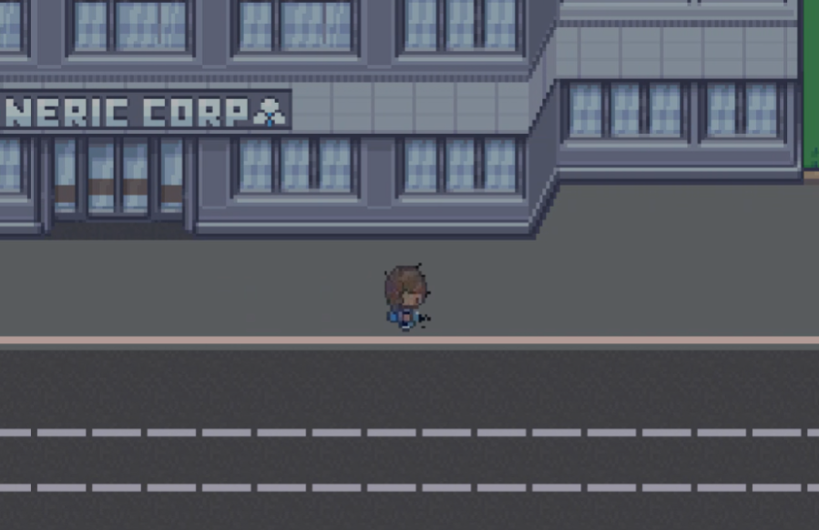

Figura 3.3.4.1 - parte do concept do mapa do jogo

Fonte: Material produzido pelos autores, 2026.

Dificuldades Encontradas O maior desafio técnico enfrentado pela equipe esteve diretamente ligado à curva de aprendizado do Tiled e sua integração com o motor do jogo. O processo de criação do mapa demandou estudo desde os conceitos iniciais da ferramenta até a descoberta das bibliotecas corretas.
A alta complexidade em manipular múltiplas ferramentas de design e programação simultaneamente motivou a decisão de reduzir o escopo geográfico do jogo nesta sprint. Além disso, a transição entre o mapa exportado e a sua renderização tornou-se um grande obstáculo. Compreender como a arquitetura de dados era alocada no arquivo JSON gerado pelo Tiled e conectar essas referências internas com os assets de imagem carregados no código exigiu muitas revisões para que o cenário fosse reproduzido fielmente e sem falhas de textura.

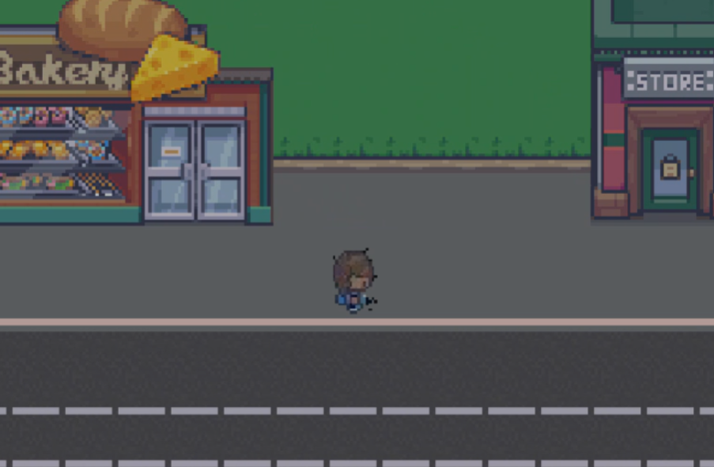
Figura 3.3.4.1 - parte do concept do mapa do jogo
Fonte: Material produzido pelos autores, 2026.

Próximos Passos (Sprint 3)
Expansão e Detalhamento do Cenário: Adicionar novos detalhes visuais aos estabelecimentos atuais e planejar a expansão do mapa para incluir novos comércios.
Inserção de NPCs: Adicionar os sprites dos clientes e lojistas nos respectivos cenários (escritório, padaria e loja de roupas).
Mecânicas de Interação: Implementar áreas de sobreposição (overlaps) para que o personagem consiga interagir com os NPCs e iniciar o fluxo de vendas ou diálogo.

## 4.3. Desenvolvimento intermediário do jogo (sprint 3)

*Descreva e ilustre aqui o desenvolvimento da versão intermediária do jogo, explicando brevemente o que foi entregue em termos de código e jogo. Utilize prints de tela para ilustrar. Indique as eventuais dificuldades e próximos passos.*

## 4.4. Desenvolvimento final do MVP (sprint 4)

*Descreva e ilustre aqui o desenvolvimento da versão final do jogo, explicando brevemente o que foi entregue em termos de MVP. Utilize prints de tela para ilustrar. Indique as eventuais dificuldades e planos futuros.*

## 4.5. Revisão do MVP (sprint 5)

*Descreva e ilustre aqui o desenvolvimento dos refinamentos e revisões da versão final do jogo, explicando brevemente o que foi entregue em termos de MVP. Utilize prints de tela para ilustrar.*

# 5. Testes

## 5.1. Casos de Teste (sprints 2 a 4)

*Descreva nesta seção os casos de teste comuns que podem ser executados a qualquer momento para testar o funcionamento e integração das partes do jogo. Utilize tabelas para facilitar a organização.*

*Exemplo de tabela*
\# | pré-condição | descrição do teste | pós-condição 
--- | --- | --- | --- 
1 | posicionar o jogo na tela de abertura | iniciar o jogo desde seu início | o jogo deve iniciar da fase 1
2 | posicionar o personagem em local seguro de inimigos | aguardar o tempo passar até o final da contagem | o personagem deve perder uma vida e reiniciar a fase
3 | ...

## 5.2. Testes de jogabilidade (playtests) (sprint 5)

### 5.2.1 Registros de testes

*Descreva nesta seção as sessões de teste/entrevista com diferentes jogadores. Registre cada teste conforme o template a seguir.*

Nome | João Jonas (use nomes fictícios)
--- | ---
Já possuía experiência prévia com games? | sim, é um jogador casual
Conseguiu iniciar o jogo? | sim
Entendeu as regras e mecânicas do jogo? | entendeu as regras, mas sobre as mecânicas, apenas as essenciais, não explorou os comandos complexos
Conseguiu progredir no jogo? | sim, sem dificuldades  
Apresentou dificuldades? | Não, conseguiu jogar com facilidade e afirmou ser fácil
Que nota deu ao jogo? | 9.0
O que gostou no jogo? | Gostou  de como o jogo vai ficando mais difícil ao longo do tempo sem deixar de ser divertido
O que poderia melhorar no jogo? | A responsividade do personagem aos controles, disse que havia um pouco de atraso desde o momento do comando até a resposta do personagem

### 5.2.2 Melhorias

*Descreva nesta seção um plano de melhorias sobre o jogo, com base nos resultados dos testes de jogabilidade*

# 6. Conclusões e trabalhos futuros (sprint 5)

*Escreva de que formas a solução do jogo atingiu os objetivos descritos na seção 1 deste documento. Indique pontos fortes e pontos a melhorar de maneira geral.*

*Relacione os pontos de melhorias evidenciados nos testes com plano de ações para serem implementadas no jogo. O grupo não precisa implementá-las, pode deixar registrado aqui o plano para futuros desenvolvimentos.*

*Relacione também quaisquer ideias que o grupo tenha para melhorias futuras*

# 7. Referências (sprint 5)

Dock Tech (2025). Pix: sistema de pagamentos instantâneos do Banco Central completa cinco anos.
https://dock.tech/fluid/blog/financeiro/pix-sistema-pagamentos-instantaneos-banco-central/

Exame (2024). 3 anos de Open Finance no Brasil: os benefícios, desafios e perspectivas futuras.
https://exame.com/future-of-money/3-anos-de-open-finance-no-brasil-os-beneficios-desafios-e-perspectivas-futuras/?utm_source=copiaecola&utm_medium=compartilhamento

Edrone (2026). Os dados do e-commerce no Brasil são animadores e colocam o país entre os maiores players deste mercado para os próximos anos.
https://edrone.me/pt/blog/dados-ecommerce-brasil

BP Money (2024). Mercado Pago lidera lucros e ultrapassa Stone e PagBank.
https://bpmoney.com.br/economia/mercado-pago-lidera-lucros/

InfoMoney (2026). PagSeguro e Stone: mudanças na gestão podem marcar um ponto de inflexão.
https://www.infomoney.com.br/mercados/pagseguro-e-stone-mudancas-na-gestao-podem-marcar-um-ponto-de-inflexao/

Finsiders Brasil (2023). Nubank e Inter são "vencedores claros" na corrida dos bancos digitais, diz Itaú BBA.
https://finsidersbrasil.com.br/negocios-em-fintechs/nubank-e-inter-sao-vencedores-claros-na-corrida-dos-bancos-digitais-diz-itau-bba/

Inovadesk (2026). Por que o aumento de preços de componentes está impactando computadores em 2026 e como as empresas podem se preparar.
https://blog.inovadesk.com.br/aumento-precos-componentes-impacto-computadores-2026/

			

 

Cielo 30 anos: linha do tempo da empresa se confunde com a própria história dos meios de pagamentos no Brasil
https://blog.cielo.com.br/institucional/linha-do-tempo-cielo/

Cielo (2026). Maquininhas e tipos de soluções 
https://www.cielo.com.br/?utm_source=googleads&utm_medium=cpa&utm_campaign=alp_cl_cpa_produtos-link-de-pagamen_cov_googleads_google-ads_conv_Finance_na&utm_content=search_search-responsivo_multiple_NU_nu_Finance_kew_ciel00127al&utm_term=ciel00127al&gclsrc=aw.ds&gad_source=1&gad_campaignid=21772459388&gbraid=0AAAAADmNSE-IueEtnhhh9nLL-MQhc0Zw0&gclid=Cj0KCQiAtfXMBhDzARIsAJ0jp3ABjNE7ezdom_SI5NikZR4HekoNZFBDD5PCIU0ToFUkSGUy8kF45Y8aAuu9EALw_wcB

Dinheiro(2026). Melhor maquininha de cartão (fevereiro de 2026)
https://www.idinheiro.com.br/negocios/maquininha-de-cartao-de-credito/

Investing(2026).Os acionistas controladores fizeram uma oferta de US$ 1,2 bilhão para fechar o capital da empresa brasileira de pagamentos Cielo.
https://www.investing.com/news/stock-market-news/controlling-shareholders-bid-to-take-brazil-payments-firm-cielo-private-for-12-billion-3293319?utm_source=chatgpt.com

InvestingNews(2021).Por que a Cielo vale menos se é líder de mercado?
https://investnews.com.br/colunistas/por-que-a-cielo-vale-menos-se-e-lider-de-mercado/?utm_source=chatgpt.com

ITAÚ BBA. Cielo (CIEL3): Previsão de resultados do 3T23. São Paulo: Itaú BBA, 1 nov. 2023. Disponível em: https://mindassets.cloud.itau.com.br/attachments/688d93a7-c65d-4db5-a436-1934a1c38220/DAP_CIEL_20231101.pdf. Acesso em: 23 fev. 2026.

BTG PACTUAL. Cielo (CIEL3): Análise de Ativo e Research. São Paulo: BTG Pactual, 2024. Disponível em: https://content.btgpactual.com/research/ativo/CIEL3. Acesso em: 23 fev. 2026.

Cielo. (2024). Relatório de resultados 4T23 e projeções estratégicas. Relações com Investidores Cielo. https://ri.cielo.com.br/
Forbes Brasil. (2024, 5 de fevereiro). Cielo foca em eficiência operacional e novos serviços para combater avanço do Pix. https://forbes.com.br/forbes-money/2024/02/cielo-tem-lucro-liquido-de-r-490-milhoes-no-4o-trimestre/
InfoMoney. (2024, 14 de agosto). Cielo sai da bolsa: O que muda para a empresa e para o setor. https://www.infomoney.com.br/mercados/cielo-fechamento-de-capital-reestruturacao/

Biz. (2024). O mercado de adquirência no Brasil: Tradicionais vs. Fintechs. https://biz.com.br/artigos/mercado-adquirencia
InvestNews. (2025, 10 de janeiro). As estratégias das adquirentes para recuperar margens com IA e novos produtos. https://investnews.com.br/financas/estrategias-adquirentes-2025/
Mobile Time. (2025, 22 de janeiro). Tap to Phone e a desmaterialização das maquininhas no Brasil. https://www.mobiletime.com.br/noticias/22/01/2025/tap-to-phone-brasil/
Silva Lopes Advogados. (2024). Modelos de negócio no setor de pagamentos: Adquirentes e subadquirentes. https://silvalopes.adv.br/modelos-pagamentos/
Suno Notícias. (2024). Cielo e o desafio do setor de maquininhas: Como a empresa se reinventa. https://www.suno.com.br/noticias/cielo-ciel3-desafios-setor-adquirencia/
Valor Econômico. (2023, 20 de outubro). A estratégia das adquirentes para não perder espaço para o pagamento instantâneo. https://valor.globo.com/financas/noticia/2023/10/20/maquininhas-se-adaptam-ao-pix.ghtml
Consumidor Moderno. (2018, 11 de maio). A história da maquininha de cartão e sua evolução no Brasil. https://consumidormoderno.com.br/historia-maquininha-de-cartao/
InfoMoney. (2023, 15 de maio). Como o Pix virou uma ameaça para o mercado das maquininhas de cartão. https://www.infomoney.com.br/mercados/como-o-pix-virou-uma-ameaca-para-o-mercado-das-maquininhas-de-cartao/
Exame. (2024). Além das maquininhas. https://exame.com/revista-exame/alem-das-maquininhas/
Pininfarina Brasil. (2025). Maquininha de cartão: as que dominam o mercado em 2025. https://www.pininfarina.com.br/maquininha-de-cart%C3%A3o-as-que-dominam-o-mercado-em-2025
Educando Seu Bolso. (2025). Ranking de máquinas de cartão. https://educandoseubolso.blog.br/rankings/ranking-de-maquinas-de-cartao/
iDinheiro. (2025). Maquininha de cartão de crédito. https://www.idinheiro.com.br/negocios/maquininha-de-cartao-de-credito/
CNN Brasil. (2020). A “guerra das maquininhas” acabou? Entenda para onde vai o mercado de pagamentos. https://www.cnnbrasil.com.br/tecnologia/a-guerra-das-maquininhas-acabou-entenda-para-onde-vai-o-mercado-de-pagamentos/
Concil. (2019). Guerra das maquininhas: O que todo varejista precisa saber. https://www.concil.com.br/guerra-das-maquininhas-o-que-todo-varejista-precisa-saber/
Exame. (2019). Uma pedra no sapato da turma das maquininhas. https://exame.com/revista-exame/uma-pedra-no-sapato/
Seu Dinheiro. (2019). PagSeguro apresenta suas armas na guerra das maquininhas de cartão. https://www.seudinheiro.com/2019/economia/pagseguro-apresenta-suas-armas-na-guerra-das-maquininhas-de-cartao/
https://www.bloomberglinea.com.br/2022/09/12/na-guerra-das-maquininhas-pagseguro-apostou-em-banco-e-agora-acelera-os-planos/
Associação Brasileira das Empresas de Cartões de Crédito e Serviços. (2023). Relatório anual do setor de meios eletrônicos de pagamento. https://www.abecs.org.br
Banco Central do Brasil. (2010). Relatório sobre a indústria de cartões de pagamento. https://www.bcb.gov.br
Banco Central do Brasil. (2013). Lei nº 12.865, de 9 de outubro de 2013. https://www.bcb.gov.br
Banco Central do Brasil. (2020). PIX: O novo meio de pagamento instantâneo brasileiro. https://www.bcb.gov.br
Porter, M. E. (2004). Estratégia competitiva: Técnicas para análise de indústrias e da concorrência. Elsevier.

# Anexos

*Inclua aqui quaisquer complementos para seu projeto, como diagramas, imagens, tabelas etc. Organize em sub-tópicos utilizando headings menores (use ## ou ### para isso)*
